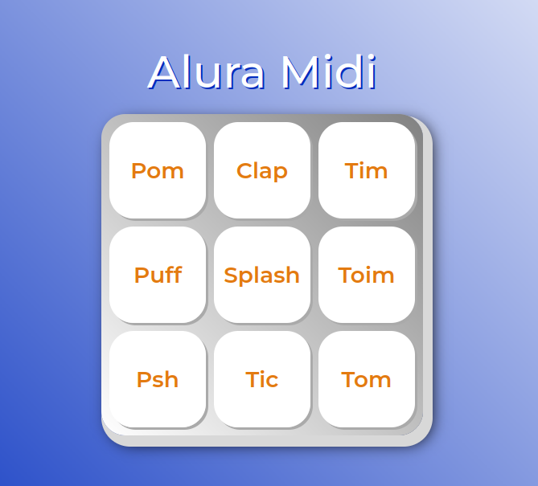

# Alura MIDI

### 🔗 [Link de acesso](https://nandoo96.github.io/alura-midi/)

> ## Projeto desenvolvido durante o curso, para reforçar conhecimentos de FrontEnd

- Clique no botão desejado
- E o som será executado
- As teclas de ESPAÇO e ENTER, também executam o som selecionado

## 💻 Tecnologias

- HTML5
- CSS3
- JavaScript

## 📧 Contato

nando96sj@gmail.com

## 📚 Plataforma de Estudos

[Alura](https://cursos.alura.com.br/dashboard)
